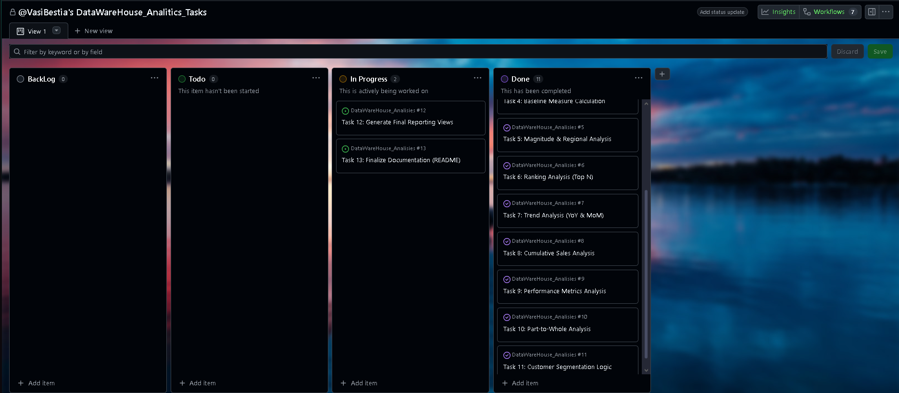

# 📊 Data Warehouse Analytics: Gold Layer Exploration


## 📖 Project Overview

This project focuses on the **Analytical Layer (Gold Layer)** of a Data Warehouse. Having established a robust ETL pipeline and a Star Schema architecture, the goal of this phase was to extract meaningful business insights using SQL.

The analysis is performed on a **Star Schema** model consisting of one Fact table (`fact_sales`) and two Dimension tables (`dim_customers`, `dim_products`), ensuring high-performance reporting.

---

## 🗺️ The Analytics Roadmap

The analysis followed a structured, 12-step roadmap divided into **Exploratory Data Analysis (EDA)** and **Advanced Analytics**. This methodical approach ensures that we first understand the data structure before diving into complex business questions.

<p align="center">
  
</p>

### Phase 1: Exploratory Data Analysis (EDA)
Before generating reports, we validated the integrity and distribution of the data:

1.  **Database Exploration:** Verifying the list of tables (`fact_sales`, `dim_customers`, `dim_products`) and their total record counts.
2.  **Dimensions Exploration:** Analyzing cardinality and distinct values in dimensions (e.g., verifying all Countries in `dim_customers` and Categories in `dim_products`).
3.  **Date Exploration:** determining the temporal scope of the data (Min/Max Order Dates) and checking for gaps in the timeline.
4.  **Measures Exploration:** Calculating high-level aggregates (Total Sales, Total Quantity) to establish baseline "Big Numbers".

### Phase 2: Advanced Analytics
Once the data was understood, we applied complex SQL techniques to answer business questions:

5.  **Magnitude Analysis:** Comparing aggregated performance across dimensions (e.g., *Total Sales by Country*).
6.  **Ranking Analysis:** Identifying top performers (e.g., *Top 5 Best-Selling Products* or *Top 10 Customers by Revenue*).
7.  **Change-Over-Time (Trend) Analysis:** calculating Year-over-Year (YoY) and Month-over-Month (MoM) growth using Window Functions.
8.  **Cumulative Analysis:** Generating Running Totals for sales throughout the fiscal year.
9.  **Performance Analysis:** Evaluating product efficiency (e.g., Average Order Value).
10. **Part-to-Whole Analysis:** Calculating the percentage contribution of specific categories to the total revenue.
11. **Data Segmentation:** Grouping customers based on purchasing behavior (e.g., identifying 'VIP' vs 'Occasional' buyers).
12. **Reporting:** Finalizing the queries into clean, reusable views for BI tools.

---
## 📅 Project Management & Development Workflow

To ensure a professional and structured delivery, this project was managed using an **Agile Kanban Board** via **GitHub Projects**. This approach allowed for clear traceability between the initial analytical roadmap and the final T-SQL implementation.

### 🗺️ From Roadmap to Action
The 12 steps defined in the **Project Roadmap** were translated into individual technical tasks (Issues). This ensured that every phase—from initial Database Exploration to complex Part-to-Whole analysis—was planned, executed, and validated systematically.

### 🛠️ Strategic Organization:
* **Backlog Management:** Used to plan future enhancements such as Incremental Loading and Power BI integration.
* **Task Categorization:** I implemented custom **Labels** to provide instant visual context:
    * `gold-layer` / `silver-layer`: Indicates the data architecture tier.
    * `sql-logic`: Highlights complex analytical queries.
    * `data-quality`: Marks essential validation and testing tasks.
* **Status Tracking:** The board maintains a clear history of completed milestones in the `Done` column, while keeping current documentation and final refinements in `In Progress`.

<p align="center">
  
</p>

> **Professional Insight:** By utilizing GitHub Projects, I demonstrate not only my SQL technical skills but also my ability to work within professional software development lifecycles (SDLC) and maintain organized project documentation.

## 🏗️ Data Model (Gold Layer)

The analysis is based on a **Star Schema** designed for efficiency.

### 1. Fact Table: `fact_sales`
The central transactional table containing the metrics.
* **Measures:** `sales`, `quantity`, `price`.
* **Foreign Keys:** Links to Customers and Products.
* **Dates:** `order_date`, `ship_date`, `due_date`.

### 2. Dimension: `dim_customers`
A **Type 1 SCD** containing consolidated customer profiles.
* **Attributes:** Customer Name, Country (derived from ERP), Gender (Standardized), Marital Status, Birthdate.
* **Logic:** Integrates CRM demographic data with ERP location data.

### 3. Dimension: `dim_products`
Contains the catalog of active products.
* **Attributes:** Product Name, Category, Subcategory, Product Line (Mountain, Road, etc.), Cost.
* **Logic:** Includes enriched category hierarchies from the ERP system.

---

## 💡 Key SQL Concepts Applied

During this analysis, the following SQL features were utilized:
* **Aggregations:** `SUM()`, `AVG()`, `COUNT(DISTINCT ...)`.
* **Window Functions:** `RANK()`, `DENSE_RANK()`, `ROW_NUMBER()`, `LEAD()`, `LAG()`.
* **Cumulative Logic:** `SUM(Sales) OVER (ORDER BY Date)`.
* **Date Functions:** `DATEDIFF`, `DATEADD`, `DATETRUNC`.
* **CTEs & Subqueries:** Used to break down complex logic into readable steps.

---

## 📂 Repository Structure

```text
├── docs/                   # Documentation and Roadmap images
├── scripts/
│   ├── 00_init/            # Database setup
│   ├── 01_eda/             # Exploratory scripts (Steps 1-4)
│   ├── 02_advanced/        # Advanced Analytics scripts (Steps 5-11)
│   └── 03_reporting/       # Final Reporting Views (Step 12)
├── README.md               # Project Documentation
└── LICENSE                 # License file
##[Author] Vasilescu Alexandru Gabriel
License MIT
